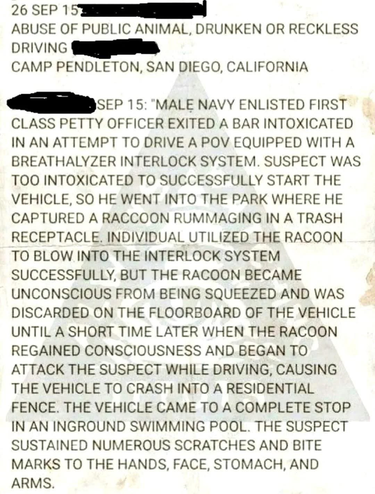

# Racoon Rescue (2026)

<p align="center">
  
</p>

**Short Film** | **Dark Comedy** | **12-15 min**

---

## Storyline

A drunk Navy petty officer can't start his car—the breathalyzer interlock won't let him. His solution? Capture a raccoon from a nearby dumpster and use it to blow into the device.

It works. The raccoon passes out. Danny drives away triumphant.

Then the raccoon wakes up.

Based on a true incident from Camp Pendleton, California, *Racoon Rescue* is a dark comedy about desperation, bad decisions, and the unstoppable force of nature's pettiest revenge.

---

## Plot Summary

DANNY VEGA, a Navy Petty Officer First Class, sits alone at a dive bar near Camp Pendleton. It's his last night before deployment, and a Dear John letter burns in his pocket. His wife found the ring he never gave her. She's with someone named Marcus now.

Drunk and stranded, Danny stumbles to his truck only to be denied by the court-mandated breathalyzer interlock—a reminder of past mistakes. He can't call anyone. His ex deleted. His buddies on base. His card maxed out.

Then he hears rustling from the dumpster.

BANDIT, a fat and confident raccoon, sits among the trash, completely unbothered by the drunk sailor watching him. A terrible, beautiful idea forms in Danny's alcohol-soaked brain.

What follows is a slapstick chase, a desperate capture, and one unconscious raccoon successfully fooling a breathalyzer. Danny tosses the limp creature onto the floorboard and peels out—a genius, he thinks.

Two minutes later, Bandit wakes up. And Bandit is angry.

The raccoon attacks. Danny loses control. The truck explodes through a white picket fence and lands in a suburban swimming pool.

As Danny sits in the shallow end, covered in scratches and chlorinated water, Bandit paddles to safety and waddles off into the night—unbothered, undefeated, and absolutely done with humanity.

---

## Cast

| Character | Description |
|-----------|-------------|
| **Danny Vega** | American, 32. Navy Petty Officer First Class. Desperate, dignified, and about to make the worst decision of his life. |
| **Bandit** | Raccoon, age unknown. Fat. Confident. Agent of chaos. Will not be disrespected. |
| **Leon** | American, 60s. Bartender at Dusty's. Seen a thousand Dannys. This one's having a worse night than most. |
| **Gerald** | American, 58. Suburban homeowner. Just wanted to sleep. Now has a truck in his pool. |
| **Jessica Chen** | American, 35. News anchor. Professional facade cracking under the weight of this story. |
| **Cop #1 & #2** | Local police. Fifteen years on the job. Nothing prepared them for this report. |

---

## Crew

| Role | Name |
|------|------|
| **Written by** | Words To Film By |
| **Based on** | True incident, Camp Pendleton Police Blotter (September 2015) |
| **Development** | WTFB Screenwriting Harness (11-Agent System) |
| **Production** | Bybren LLC |

---

## Technical Specs

| Specification | Details |
|---------------|---------|
| **Runtime** | 12-15 minutes |
| **Pages** | ~16 |
| **Aspect Ratio** | 2.39:1 (Scope) |
| **Color** | Color |
| **Language** | English |
| **Setting** | Oceanside / Camp Pendleton, California, 2015 |
| **Budget Tier** | $25,000 - $75,000 |

---

## Genres

- Dark Comedy
- Short Film
- Based on True Events

---

## Themes

- **Desperation breeds bad decisions**: Danny isn't evil—just trapped and too impaired to see any good options
- **Nature always wins**: Bandit is the true protagonist; he survives and thrives while Danny's life implodes
- **Consequences compound**: One bad choice leads to another leads to disaster

---

## Tone

*Fargo* meets *Reno 911*. The humor comes from the absurdity of the situation and the matter-of-fact way it escalates. We're not mocking Danny—we're watching a man dig himself deeper with every decision, unable to stop.

---

## Tagline

"He needed a designated driver. He found a designated blower."

---

## Keywords

`based on true story` `raccoon` `breathalyzer` `DUI` `Navy` `Camp Pendleton` `dark comedy` `short film` `swimming pool` `animal attack` `bad decisions` `2015` `California`

---

## Did You Know?

### Trivia

- The incident actually happened at Camp Pendleton in September 2015
- The real police report listed the charge as "abuse of public animal"—a charge that doesn't technically exist in California law
- The raccoon in the real incident was never found
- Danny's line "I OUTRANK YOU!" to the raccoon was improvised during development

### Goofs

- *Please report any continuity errors*

### Quotes

**Danny**: "This is either the best idea I've ever had or the worst. No in-between."

**Danny** (to raccoon): "WE HAD A DEAL!"

**Leon**: "Take care of yourself, sailor."

**Gerald**: "I don't CARE whose truck it is, it's in my POOL."

**Cop #1**: "Sir, I've been doing this for fifteen years. This is going in my memoirs."

**Jessica Chen**: "The plan was... described by police as 'technically successful.'"

---

## Connections

### References

- *Fargo* (1996) - Tone and dark comedy escalation
- *Reno 911!* (2003-2009) - Police procedural absurdity
- *A Simple Plan* (1998) - Bad decisions compounding

### Similar Films

- *The Death of Dick Long* (2019)
- *Thunder Road* (2018)
- *Wild Tales* (2014)

---

## Development Notes

This screenplay was developed using the **WTFB Screenwriting Harness**, a multi-agent system for professional screenplay development:

| Agent | Role |
|-------|------|
| Story Architect | Structure and beat sheet design |
| Research Specialist | Military, legal, and technical accuracy |
| Story Analyst | Audience engagement analysis |
| Scene Writer | Fountain screenplay drafting |
| Dialogue Writer | Character voice and dialogue polish |
| Continuity Editor | Timeline and consistency verification |
| Script Supervisor | Fountain format compliance |
| Standards Reviewer | Industry standards verification |
| Production Coordinator | Production package development |

### Project Files

| File | Description |
|------|-------------|
| `racoon-rescue.fountain` | Production-ready screenplay |
| `treatment.md` | Story overview and themes |
| `beatsheet.md` | Scene-by-scene structure |
| `research/` | Technical accuracy reference |
| `continuity_report.md` | Consistency verification |
| `production-notes.md` | Full production package |

---

## Box Office

In Development

---

## Awards

Not yet released

---

## User Reviews

Coming soon

---

## Contributing

This project uses a **PR-based workflow** for both human collaborators and AI agents.

### Branch Types

| Type | Use Case |
|------|----------|
| `feature/{name}` | New content or scenes |
| `fix/{issue}` | Targeted fixes |
| `revision/{type}` | Full-script passes |

### Quick Start

```bash
# Create a working branch
git checkout -b feature/your-feature-name

# Make changes, then commit
git commit -m "feat: add your description"

# Create PR when ready
gh pr create
```

---

## Copyright

(c) 2026 Bybren LLC / Words To Film By. All rights reserved.

Based on true events. The raccoon was never found.

---

*This README follows IMDb formatting conventions for short film presentation.*
